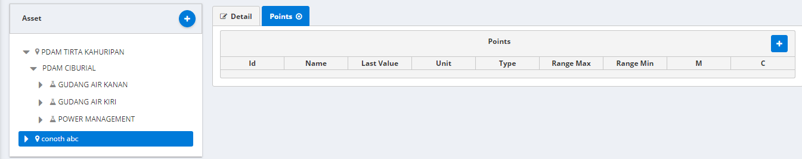
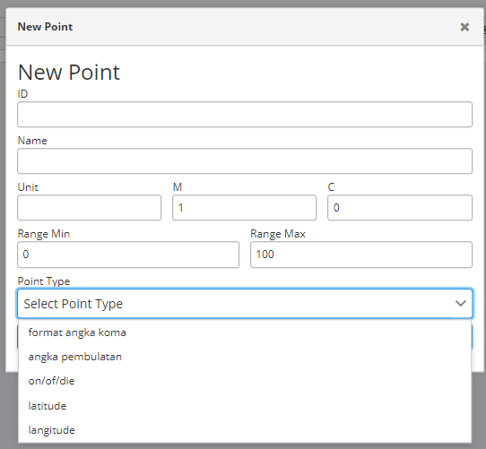

# Asset Management

Asset management merupakan halaman antarmuka yang menampilkan data-data setiap sensor yang terhubung dengan Monita

Petunjuk Penggunaan:

#### Menambahkan Asset

Untuk menambahkan asset kedalam asset management tekan tombol (+)

.png>)

Lalu memasukan nama dan memilih tipe asset seperti berikut:

.png>)

#### Menambahkan Data Point Asset

Untuk menambahkan data point pada _asset_ tekan tombol (+) hingga keluar _form_ sebagai berikut:





```
Dengan Catatan:

ID : nomor identifikasi monita

Name : nama satuan yang dihitung oleh sensor

Unit : Satuan yang dihitung oleh sensor

Range min : Jarak Minimal

Range max : Jarak Maksimal

M : ...

c : ...

Point type : tipe titik

```

#### Melihat Data Asset

Untuk melihat asset-asset yang sudah di masukan ke dalam asset management pada sebelah kiri dan data-data asset pada sebelah kanan pada _tab detail_ dan _tab points_

.png>)

.png>)
