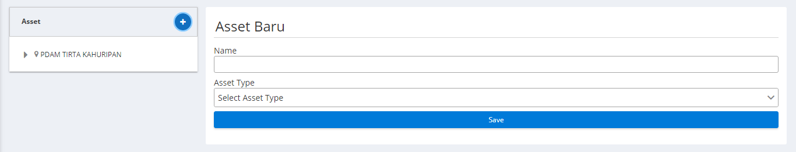

# <div class="subt" style="font-size:35px;">Asset Management</div>

Asset management merupakan halaman antarmuka yang menampilkan data-data setiap sensor yang terhubung dengan Monita

### <div class="subt">Petunjuk Penggunaan:</div>

Untuk menambahkan asset kedalam asset management maka anda bisa menekan tombol (+)



Lalu memasukan nama dan memilih tipe asset seperti berikut:


Untuk menambahkan point pada _asset_ anda bisa menekan tombol (+) hingga keluar _form_ sebagai berikut:


<br>
<br>
<br>

<br>
<br>
<br>

```
Dengan Catatan:

ID : nomor identifikasi monita

Name : nama satuan yang dihitung oleh sensor

Unit : Satuan yang dihitung oleh sensor

Range min : ....

Range max : ....

M : ...

c : ...

Point type : tipe titik

```

Anda dapat melihat asset-asset yang sudah di masukan ke dalam asset management pada sebelah kiri dan data-data asset pada sebelah kanan pada tab detail points dan tab points


<br>
<br>
<br>

