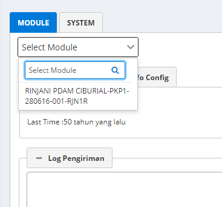
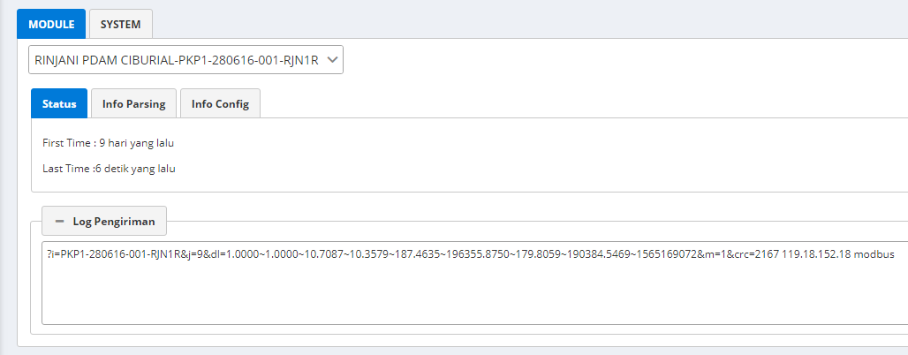
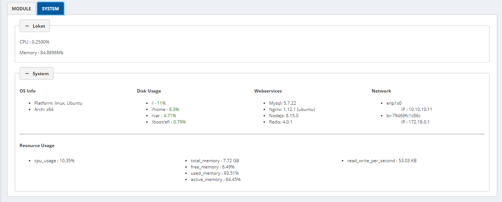

# Dashboard

Dashboard merupakan halaman antarmuka yang menampilkan data-data dari setiap modul

Petunjuk Peggunaan:

Untuk melihat data dari server, pilihlah modul yang ingin di lihat dari _dropdown_ seperti di gambar

Untuk melihat data serta informasi parsing dan informasi Konfigurasi pada _tab Info Parsing_ Dan _tab info Config_

Untuk melihat data sistem tekan _Tab System_

