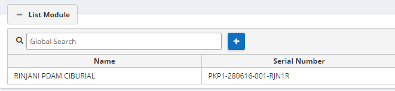
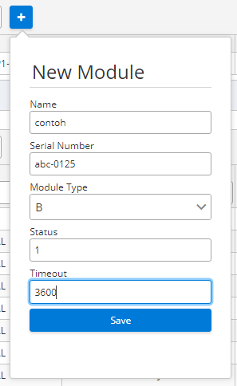
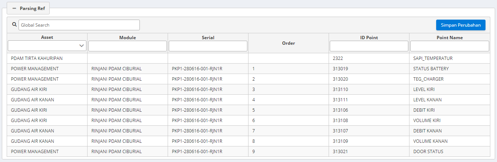
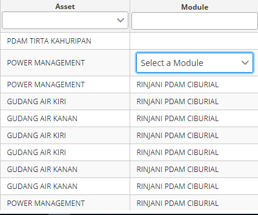
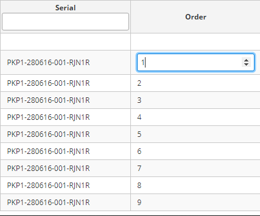
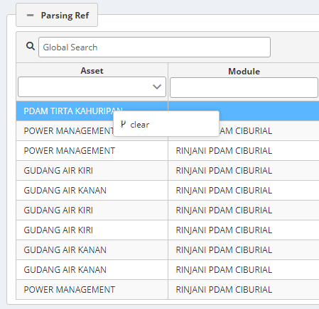

<style>
   .mps {
       position: absolute;
       top: 93%;
   }
</style>

# <div class="subt" style="font-size:35px;">Module Parsing</div>

Module Parsing merupakan halaman antarmuka pada Monita Admin yang digunakan untuk mengelola data serta urutan agar data dapat masuk secara teratur.

<div class="subt">Petunjuk Penggunaan:</div>

<div class="mps">

#### <div class="t1">Menambahkan Modul</div>

Untuk menambahkan modul kedalam modul parsing _klik_ tombol (+) dan mulai memasukan data modul


<br>
<br>
<br>

<br>
<br>
<br>

```
dengan catatan:

Name: Nama modul

Serial Number: Nomor seri Modul

Module Type: Tipe modul

Status: kondisi keadaan modul (1: hidup 0: mati)

Timeout: Lama waktu pengiriman data modul dari data 1 ke data berikutnya (dalam satuan detik)
```

**Uraian dari suatu modul atau asset dapat dilihat di _Parsing ref_**

#### <div class="t1">Menambahkan Data Asset</div>

jika ingin menambahkan data kepada suatu asset, klik pada kolom yang tersedia lalu klik _simpan perubahan_


<br>
<br>

#### <div class="t1">Merubah Modul dan Urutan (_order_) Asset</div>

Jika ingin merubah modul atau urutan suatu asset, _klik_ asset yang ingin diubah

<br>
<br>

<br>
<br>

#### <div class="t1">Menghapus Asset</div>

Jika ingin menghapus suatu asset, _klik_ kanan pada asset yang ingin dihapus

<br>
<br>
<br>

</div>
