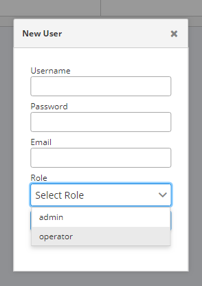
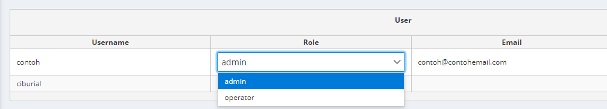
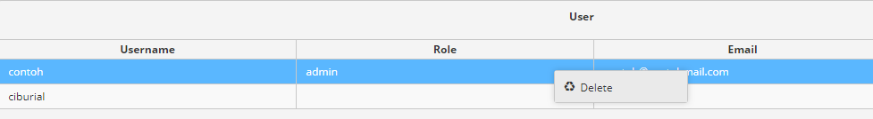

# User Management

User management merupakan halaman antarmuka yang digunakan untuk mengelola dan menampilkan data para pengguna Monita Admin

Petunjuk Penggunaan:

#### Menambahkan Pengguna

Pada halaman ini, untuk menambahkan pengguna baru _klik_ tombol (+) untuk memunculkan _form_ sebagai berikut:

#### Merubah Data Pengguna

Jiks ingin merubah data pengguna, _klik_ data sebagai berikut:

#### Menghapus Data Pengguna

Jika ingin menghapus data pengguna, _klik_ kanan pada data sebagai berikut:

