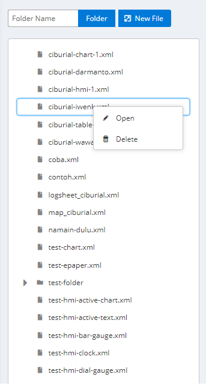
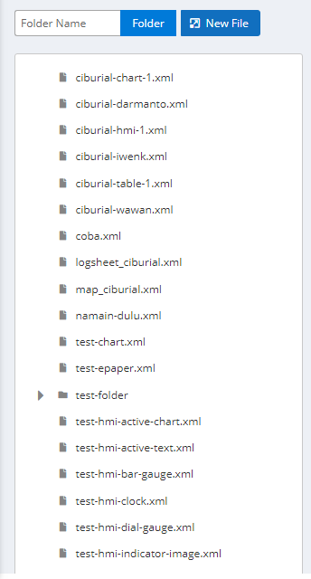
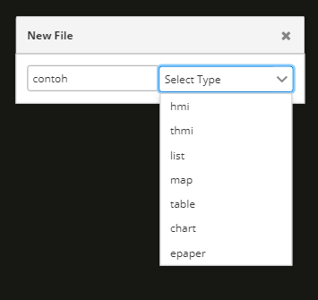
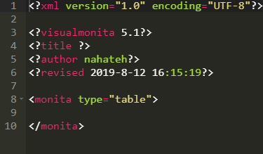

# Visual Editor

Visual Editor digunakan untuk mengelola data-data yang terdapat pada Visual Monita

### Petunjuk Penggunaan:

#### List Data

_Klik_ kanan pada list data untuk membukanya

#### Kolom edit

Pada kolom edit terdapat beberapa fitur, yaitu:

1. Editing space

   

2. Pengubah ukuran font

   

3. Dropdown untuk mengganti themes editor

   

#### Menambahkan File Baru

1. _Klik_ tombol _new file_

   

2. Masukan nama file dan pilih jenisnya

   

3. contoh file

   
