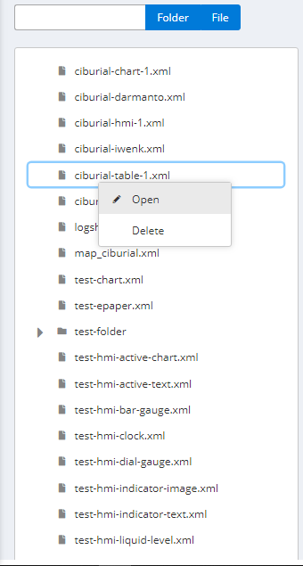
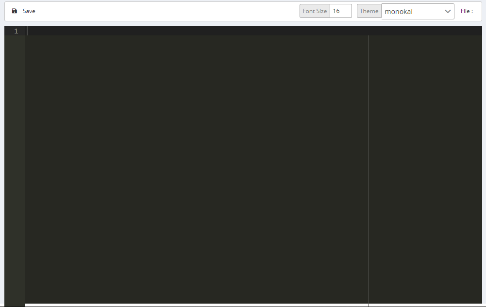
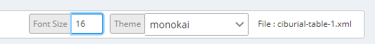
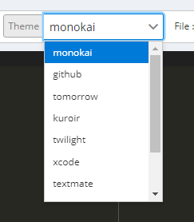

# Visual Editor

Visual Editor digunakan untuk mengelola data-data yang terdapat pada Visual Monita

### Petunjuk Penggunaan:

#### List Data

_Klik_ kanan pada list data untuk membukanya

#### Kolom edit

Pada kolom edit terdapat beberapa fitur, yaitu:

1. editing space

   

2. pengubah ukuran font

   

3. dropdown untuk mengganti themes editor

   
