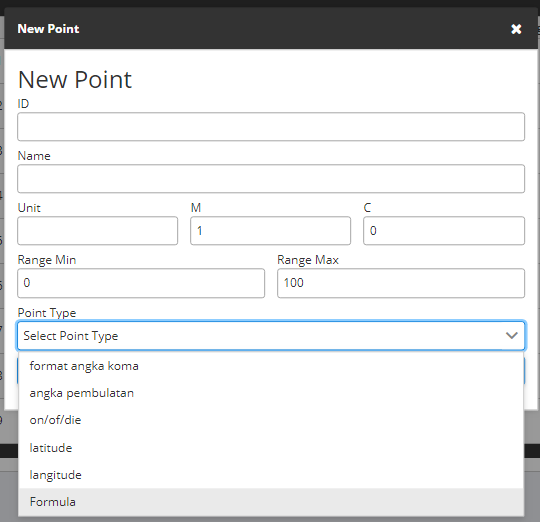
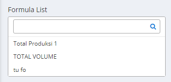
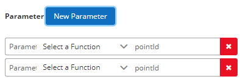
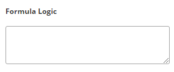
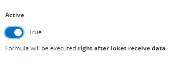
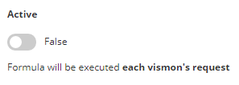
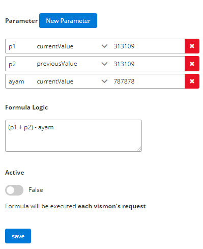

# Formula

Formula digunakan untuk menggabungkan value point satu dengan yang lainnya

### Petunjuk Penggunaan

#### 1. Formula

- untuk menambahkan point formula pada admin monita, anda bisa _meng-klik_ tombol tambah (+) pada _Asset Management_

- pada sebelah kiri laman formula, anda dapat melihat list value untuk diubah digabungkan parameternya.

#### 2. Parameter

- untuk menambahkan parameter and bisa menekan tombol new parameter

- anda bisa mengisi formual untuk value pada kolom formula logic

- setelah itu apabila anda ingin menentukan apabila formula ingin segera di proses oleh loket, anda bisa menyalakan _slider active_ menjadi true

- tapi apabila anda menginginkan formula di proses setiap kali ada request ke _soklat_, anda bisa menyalakan _slider active_ menjadi false

### Contoh Dokumen

- berikut adalah contoh penggunaan formula

