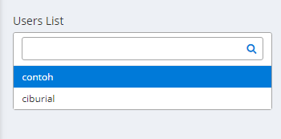
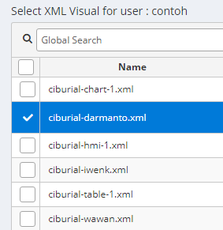
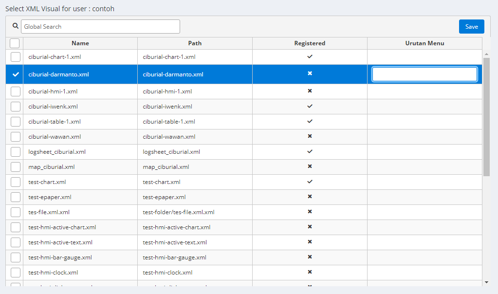

# Visual Menu

Visual menu digunakan untuk mengurutkan data

### Petunjuk Penggunaan:

#### 1. User

Jika ingin menggunakan Visual Menu, Pilih terlebih dahulu _user-nya_

#### 2. Mengurutkan Data

Pilih Data

Klik kolom Urutan Menu dan ketik urutan datanya

